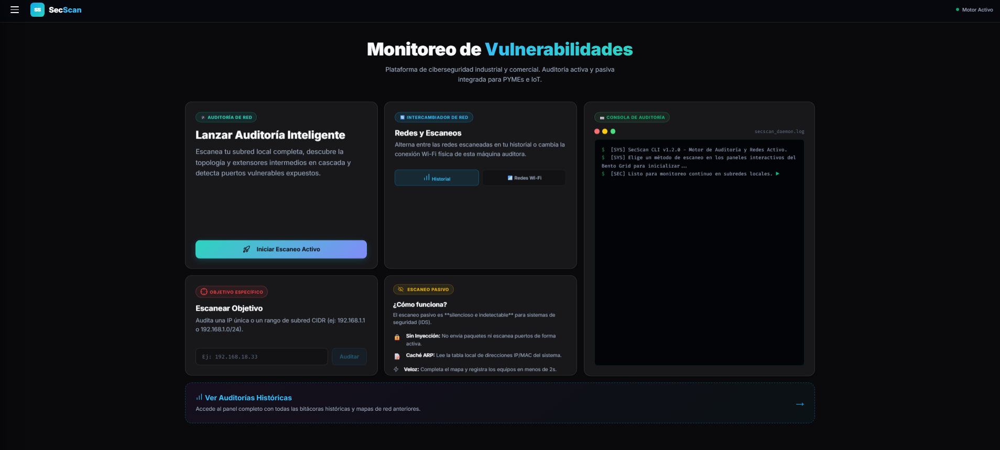
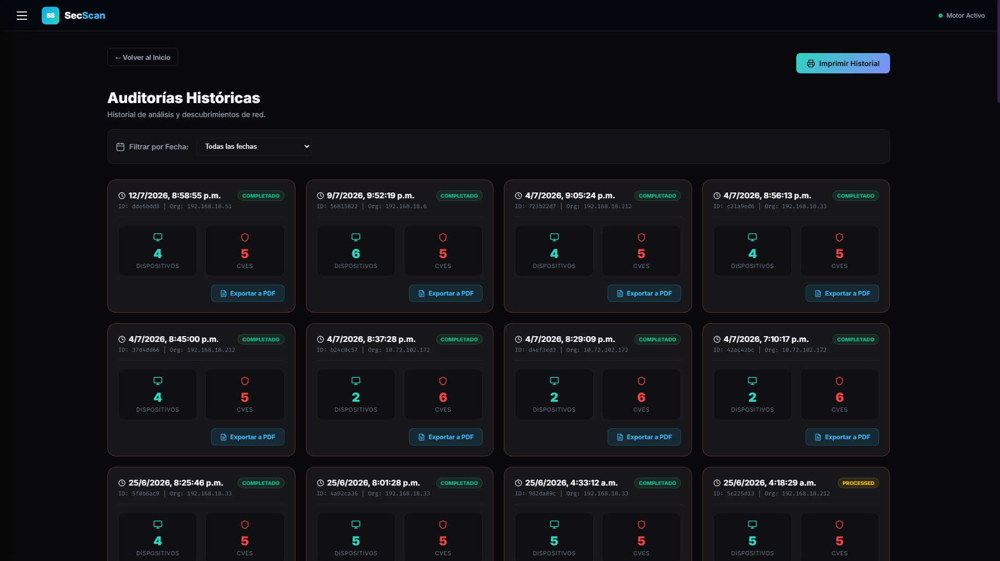
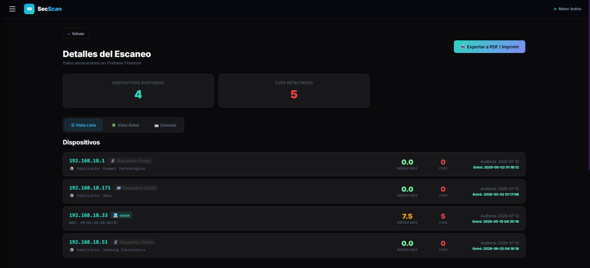
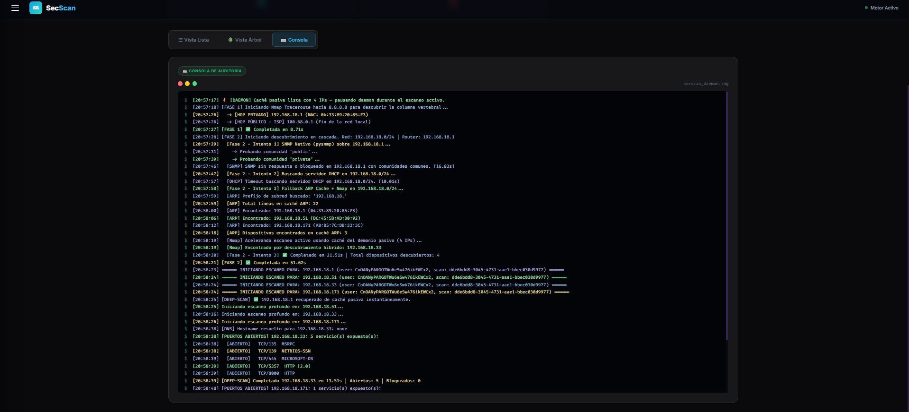
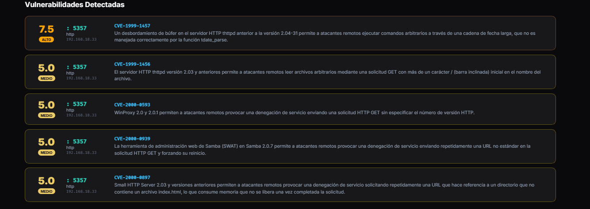

# SecScan — Network Vulnerability Scanner

A full-stack network security monitoring tool that continuously scans your local network for connected devices, open ports, and known vulnerabilities (CVEs), built as a university thesis project.


---

## Screenshots



| Dashboard — Scan History | Scan Results — Device List |
|:---:|:---:|
|  |  |

| Audit Console | Vulnerability Report |
|:---:|:---:|
|  |  |

---

## Features

- **Network Discovery** — Detects all devices on the local network (IP, MAC, hostname, manufacturer)
- **Deep Port Scanning** — Scans the top 100 ports per device using Nmap with service version detection
- **CVE Vulnerability Matching** — Cross-references open services against the NVD database via API
- **SNMP Integration** — Retrieves extended device information via SNMP protocol
- **WiFi Scanner** — Lists nearby WiFi networks and allows connecting to them from the UI
- **Passive Background Daemon** — Continuously monitors the network for new devices in the background
- **Scan History** — Full audit log of every scan, stored persistently in Firebase Firestore
- **Audit Console** — Real-time color-coded terminal output showing open/blocked/filtered ports
- **PDF Export** — Print any scan report as a structured 3-page PDF (summary, devices, vulnerabilities)
- **Dark Mode UI** — Professional SOC-style dashboard built in React with chart visualizations

---

## Tech Stack

| Layer | Technology |
|---|---|
| Backend API | Python 3.10+, FastAPI, Uvicorn |
| Network Scanning | Nmap (python-nmap), SNMP |
| CVE Database | NVD REST API v2 |
| Frontend | React 18, Vite, Lucide Icons |
| Database | Firebase Firestore (cloud) + SQLite (local fallback) |
| Auth | Firebase Authentication |

---

## Prerequisites

- **Python 3.10+** (add to PATH during installation)
- **Node.js v18+**
- **Nmap** — The app can install it automatically on first run
- A **Firebase project** with Firestore and Authentication enabled

---

## Installation

### 1. Clone the repository
```bash
git clone https://github.com/MartinQuintanaC/secscan-tesis.git
cd secscan-tesis
```

### 2. Backend setup
```bash
cd backend
python -m venv venv

# Windows
.\venv\Scripts\activate

# macOS / Linux
source venv/bin/activate

pip install -r requirements.txt
```

> **Important:** You need a `firebase_admin.json` credentials file from your Firebase project console.  
> Place it inside the `backend/` folder. This file is intentionally excluded from the repository.

### 3. Frontend setup
```bash
cd frontend
npm install
```

---

## Running the app

Use the included batch file on Windows for a one-click start:
```
iniciar_secscan.bat
```

Or manually in separate terminals:

**Terminal 1 — Backend:**
```bash
cd backend
.\venv\Scripts\activate
uvicorn app:app --reload
```

**Terminal 2 — Frontend:**
```bash
cd frontend
npm run dev
```

Then open [http://localhost:5173](http://localhost:5173) in your browser.

---

## Project Structure

```
secscan/
├── backend/
│   ├── app.py                  # FastAPI entry point
│   ├── requirements.txt
│   ├── core/
│   │   ├── scanner.py          # Nmap scanning engine
│   │   ├── cve_client.py       # NVD CVE API client
│   │   ├── firebase_client.py  # Firebase initialization
│   │   └── local_db.py         # SQLite offline fallback
│   ├── services/
│   │   ├── scan_service.py     # Orchestration + passive daemon
│   │   ├── db_service.py       # Database abstraction layer
│   │   └── sync_service.py     # Local ↔ Cloud sync
│   └── api/v1/endpoints/
│       ├── scans.py            # Scan trigger and history endpoints
│       ├── devices.py          # Device listing endpoints
│       ├── wifi.py             # WiFi scan and connect endpoints
│       └── system.py           # Health check and Nmap installer
└── frontend/
    └── src/
        ├── App.jsx             # Main app + all page components
        ├── components/
        │   └── NetworkTree.jsx # Interactive network topology visualization
        ├── pages/
        │   ├── ScanHistoryPage.jsx
        │   └── LoginPage.jsx
        └── services/
            └── api.js          # API client functions
```

---

## Notes

- The scanner uses `--top-ports 100` by default for a balance between speed and coverage
- Up to 4 devices are scanned in parallel using `ThreadPoolExecutor`
- The passive daemon pauses automatically when an active scan is in progress
- Blocked/filtered ports are logged in the audit console with the reason reported by Nmap

---

## Author

**Martín Quintana** — Network Security & Full-Stack Development  
Thesis project — Computer Science / Systems Engineering
